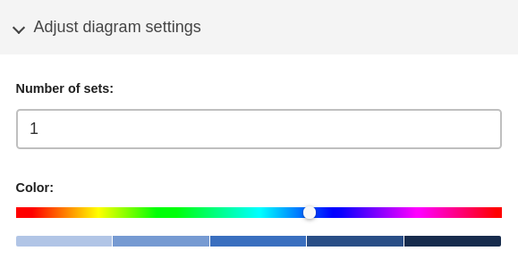
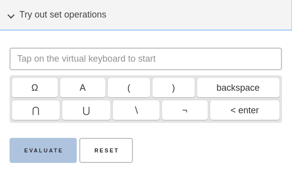
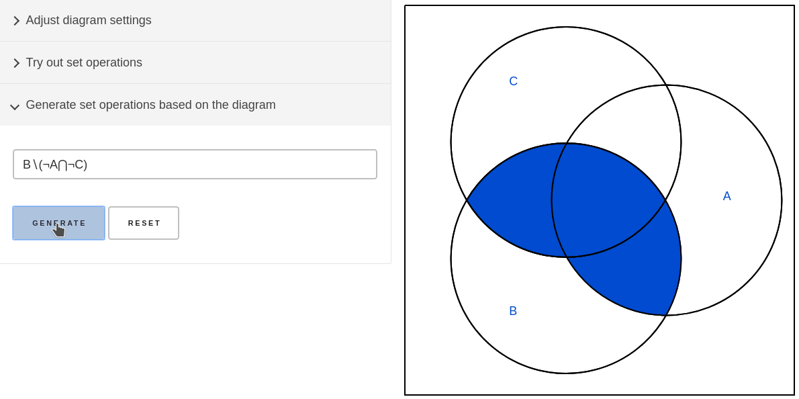

<!-- AUTO-GENERATED-CONTENT:START (STARTER) -->

  

# Venn Diagrams

> Venn Diagrams visualizes set operations with up to 4 sets.

This tool, developed at and for the [University of Applied Science Brandenburg](https://www.th-brandenburg.de/), is meant to help students learning set operations by visualizing these.
Operations can be tested by utilising the intuitive virtual keyboard.
To get operations resulting in a desired set, in the diagram the set can be selected  and
the operations be generated.

If you like to contribute or found a bug please don't be shy and check out the [Contributing](#contributing) section.

## Table of Contents

- [Security](#security)
- [Install](#install)
- [Usage](#usage)
- [Maintainers](#maintainers)
- [Credits](#credits)
- [Contributing](#contributing)
  - [Todo](#todo)
  - [Pull Requests](#pull-requests)
- [License](#license)

## Security

There is no data collected wether you use the online or offline version.
Anything you do with this tool only is available as long as you keep your browser or the app open. A refresh resets the site to its initial state.

## Install

Installation is usually not necessary. Just use the [online version](https://venndiagrams.ixitos.com).

## Usage

1. **Adjust the settings as you please**

  

  Select the number of sets you want to work with.

  Choose a color for the diagram or stay with the default.

2. **Start playing by:**

	  1. **Trying out set operations**

	     

	     Use the virtual keyboard to enter operations.
	     This prevents errors on input.
         
	     Then click the `< enter` key on the keyboard or press `Evaluate`.

	  2. **Generating set operations based on the diagram**

	     

	     Click some sets in the diagram.
         
	     Then hit the `Generate` button.

## Maintainers

- [@Jan Vandenhouten](mailto:vandenho@th-brandenburg.de)

- [@Fabian Loewe](mailto:fabianl@th-brandenburg.de)

## Credits

See the [contributers file](CONTRIBUTERS.md).

Special thanks go to all developers of our used dependencies and tools and to
our [university](https://www.th-brandenburg.de/) for the idea and support for creating this tool.

## Contributing

If you make changes to code please stay with the current code style. It's
the conventional JavaScript code style.

### Todo

- **Help with code cleanup**

    There are some unnecessary lines of code and comments and even hole unused files.

- **Unify visualization components**

    Because of the incremental development steps there is some discrepancy in the visualization between the one-set and the other set diagrams. This could be optimized.

- **Add translations**

    There could be more translations. You can start be copying on of the YAML files at `src/langs` and translate them.

### Pull Requests

Pull Requests are happily accepted but use this [template](PULL_REQUEST_TEMPLATE.md). Otherwise it will be rejected.

Don't forget to add yourself to the [contributers file](CONTRIBUTERS.md)!

> Small note: If editing the Readme, please conform to the [standard-readme](https://github.com/RichardLitt/standard-readme) specification.

## License

[MIT](LICENSE)
